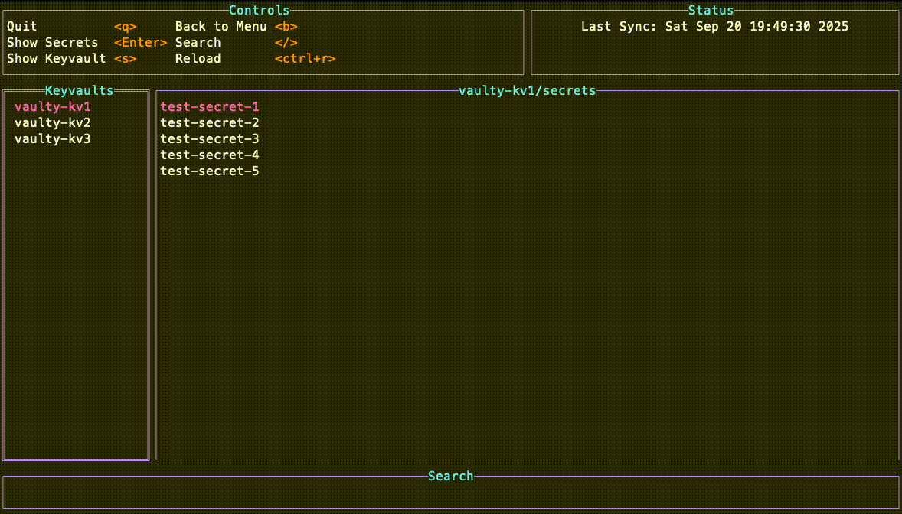

# Vaulty

An Azure Keyvault TUI, written in Golang using [tview](https://github.com/rivo/tview/tree/master). 



Vaulty is under active development and is subject to change. 

## Building from source

1. Clone the repository
2. Update vaulty.conf

``` yaml
Keyvaults:
  - Name: <keyvault-name>
    Subscription: <keyvault-subscription-id>
  - Name: <keyvault-name>
    Subscription: <keyvault-subscription-id>
  - Name: <keyvault-name>
    Subscription: <keyvault-subscription-id>
```
3. Build and run the executable

``` bash
make && ./bin/vaulty
```

# Roadmap
- Bug fixing
- Global search
- Secret modification/deletion
- Certificates management
- Keys mananagement
- Themes


